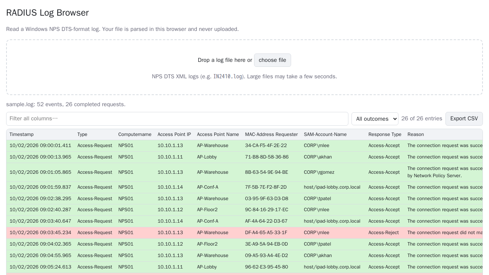

# RADIUS Log Browser (web)

Read a Windows NPS (Network Policy Server) **DTS-format** log in your browser: sortable, filterable, colour-coded, with plain-English reasons.

**Live:** https://radius.2haks.xyz



Everything runs locally in the page. Your log is never uploaded (logs contain usernames and MAC addresses), and the site's Content-Security-Policy forbids network requests.

## Use it

Open the live site, or serve this folder with any static web server (`python3 -m http.server`), then drop in a log file. `sample.log` is a small made-up log to try.

- Green rows are Access-Accept, red rows are Access-Reject
- Click a header to sort, type to filter every column, or filter by outcome
- Click a row to read the full reason text
- Export what you're looking at to CSV

## Credit

This is a web rewrite of the original Windows desktop app **[RADIUS-Log-Browser](https://github.com/burnacid/RADIUS-Log-Browser)** (C# / WinForms), created by **Stefan Lenders** (burnacid), with contributions from **Christian Tarne** (Metropo). The C# source has been removed from this fork; it remains in the git history and in the original repo. The original had no license file, so all credit for the idea, the log-handling approach and the code tables belongs to them.

## What I learned from the C# version

Reading the original was the spec. The parts worth keeping:

1. **A log "entry" is two events.** NPS writes the request and its response as separate `<Event>` elements, linked only by a shared `<Class>` value. The first event seen for a class is the request, and the next one with the same class completes the row:
   ```
   Event 1: Packet-Type=1 (Access-Request), User=CORP\jsmith, Class=c7
   Event 2: Packet-Type=3 (Access-Reject),  Reason-Code=16,   Class=c7   -> one red row
   ```
2. **The file isn't valid XML.** It's a bare run of `<Event>` elements with no root. The original wraps it in `<events>…</events>` before parsing, and so does this version.
3. **Numbers become words.** `Packet-Type` 1/2/3/4/5/11… map to names like Access-Request, and `Reason-Code` maps to Microsoft's explanation (`16` is "user credentials mismatch", `265` is "certificate chains to an untrusted root"). Those 9 packet types and 92 reason codes were extracted straight from the C# tables.
4. **Fields are optional.** Wireless events often lack some fields. The original falls back from `SAM-Account-Name` to `User-Name` to `- UNKNOWN -` for the user and tolerates a missing `NAS-Identifier` or `Calling-Station-Id`. A later fix for events with no `Class` is why they're skipped here.
5. **Parse in bulk.** One of the original's best commits swapped per-row UI inserts for a single bulk add. The web version does the same by rendering in 1,000-row pages.

### What changed in the port

| Original | Web version |
|---|---|
| Excel export (Office interop) | CSV export (with spreadsheet-formula protection) |
| Live tail via FileSystemWatcher | Reload the file; browsers can't watch local files |
| Right-click filter on one column | Filter box across all columns, plus an outcome dropdown |
| Windows only | Any browser |
